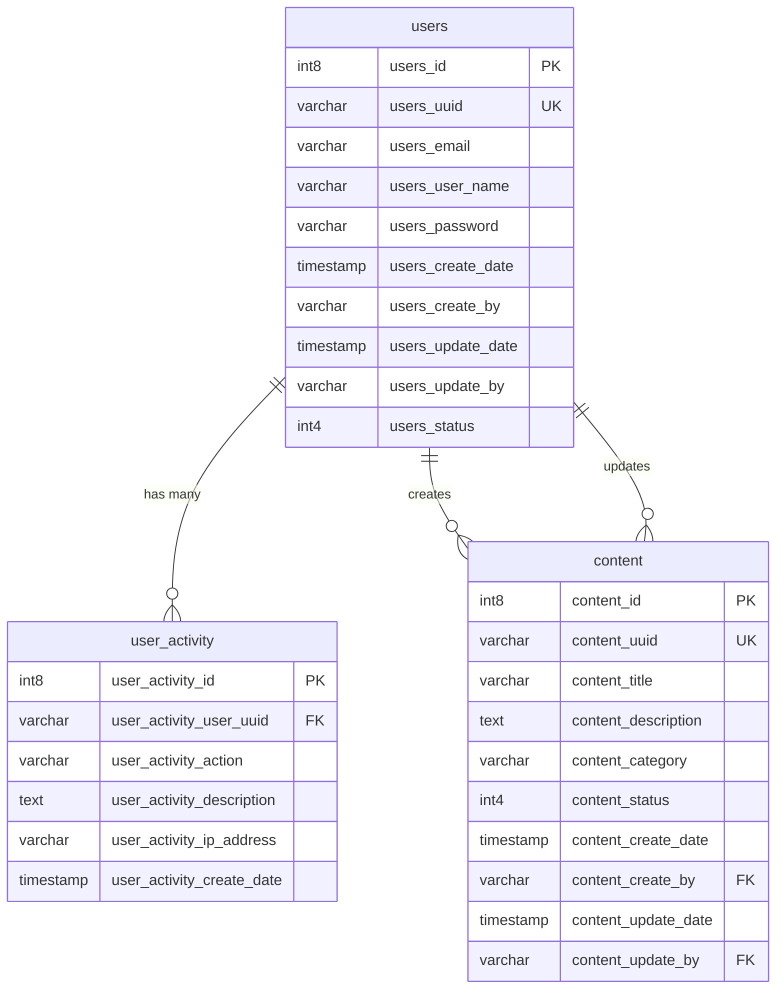

# LMS — Learning Management System

Fullstack take-home test project yang mengimplementasikan module **Authentication** dan **Content Management**.

## Tech Stack

### Backend
- **Laravel 13** (PHP 8.3)
- **JWT Authentication** — [tymon/jwt-auth](https://github.com/tymondesigns/jwt-auth)
- **PostgreSQL** — semua tabel di schema `public` (default)

### Frontend
- **Next.js 16** (React 19, TypeScript)
- **Reactstrap** (Bootstrap 5)
- **react-data-table-component** — untuk tabel data dengan sorting & pagination

## Struktur Folder

```
LMS/
├── BACKEND/       → Laravel API (REST)
│   └── README.md  → Instruksi instalasi & menjalankan backend
└── FRONTEND/      → Next.js Client
    └── README.md  → Instruksi instalasi & menjalankan frontend
```

## Fitur

- **Login** — autentikasi user dengan JWT token
- **Register** — registrasi user baru
- **Content Management** — CRUD content dengan search dan pagination
- **User Activity Logging** — pencatatan aktivitas user (login, register, CRUD)

## ERD (Entity Relationship Diagram)



### Keterangan Relasi

| Relasi | Dari | Ke | Keterangan |
|--------|------|----|------------|
| `user_activity.user_activity_user_uuid` → `users.users_uuid` | `user_activity` | `users` | Satu user bisa punya banyak activity log |
| `content.content_create_by` → `users.users_uuid` | `content` | `users` | Logical reference — user yang membuat content |
| `content.content_update_by` → `users.users_uuid` | `content` | `users` | Logical reference — user yang terakhir mengupdate content |

> **Catatan:** Relasi `content` → `users` bersifat **logical** (bukan FK constraint di database).

---

## Table Specification

### Tabel `users` — Schema: `public`

| Nama Kolom | Tipe Data | Nullable | Keterangan |
|------------|-----------|----------|------------|
| `users_id` | `int8` | **NOT NULL** | Primary key, auto-increment via sequence `users_id_seq` |
| `users_uuid` | `varchar(38)` | NULL | UUID unik sebagai identifier user (digunakan untuk referensi antar tabel) |
| `users_email` | `varchar(255)` | NULL | Alamat email user |
| `users_user_name` | `varchar(255)` | NULL | Username untuk login |
| `users_password` | `varchar(500)` | NULL | Password yang sudah di-hash (bcrypt) |
| `users_create_date` | `timestamp(6)` | NULL | Tanggal & waktu pembuatan akun |
| `users_create_by` | `varchar(38)` | NULL | UUID user yang membuat record ini |
| `users_update_date` | `timestamp(6)` | NULL | Tanggal & waktu terakhir update |
| `users_update_by` | `varchar(38)` | NULL | UUID user yang terakhir mengupdate record ini |
| `users_status` | `int4` | NULL | Status user (misal: `1` = aktif, `0` = nonaktif) |

### Tabel `user_activity` — Schema: `public`

| Nama Kolom | Tipe Data | Nullable | Keterangan |
|------------|-----------|----------|------------|
| `user_activity_id` | `int8` | **NOT NULL** | Primary key, auto-increment via sequence `user_activity_id_seq` |
| `user_activity_user_uuid` | `varchar(38)` | NULL | UUID user yang melakukan aktivitas — referensi ke `users.users_uuid` |
| `user_activity_action` | `varchar(100)` | NULL | Nama aksi yang dilakukan (contoh: `LOGIN`, `REGISTER`, `CREATE_CONTENT`, dll.) |
| `user_activity_description` | `text` | NULL | Deskripsi detail aktivitas |
| `user_activity_ip_address` | `varchar(45)` | NULL | Alamat IP user saat melakukan aktivitas (mendukung IPv4 & IPv6) |
| `user_activity_create_date` | `timestamp(6)` | NULL | Tanggal & waktu aktivitas tercatat |

### Tabel `content` — Schema: `public`

| Nama Kolom | Tipe Data | Nullable | Keterangan |
|------------|-----------|----------|------------|
| `content_id` | `int8` | **NOT NULL** | Primary key, auto-increment via sequence `content_id_seq` |
| `content_uuid` | `varchar(38)` | NULL | UUID unik sebagai identifier content |
| `content_title` | `varchar(255)` | **NOT NULL** | Judul content |
| `content_description` | `text` | NULL | Deskripsi / isi content |
| `content_category` | `varchar(100)` | NULL | Kategori content |
| `content_status` | `int4` | NULL (default `1`) | Status content (`1` = aktif, `0` = nonaktif) |
| `content_create_date` | `timestamp(6)` | NULL | Tanggal & waktu pembuatan content |
| `content_create_by` | `varchar(38)` | NULL | UUID user pembuat — logical reference ke `users.users_uuid` |
| `content_update_date` | `timestamp(6)` | NULL | Tanggal & waktu terakhir update content |
| `content_update_by` | `varchar(38)` | NULL | UUID user yang terakhir mengupdate — logical reference ke `users.users_uuid` |

---

## Instalasi

Lihat instruksi instalasi masing-masing di:

- [BACKEND/README.md](./BACKEND/README.md) — setup & jalankan backend
- [FRONTEND/README.md](./FRONTEND/README.md) — setup & jalankan frontend
